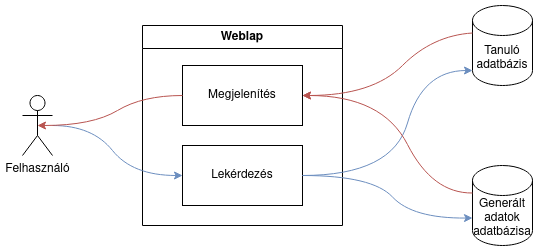
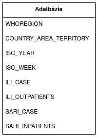

# Funkcionális specifikáció

## Jelenlegi helyzet leírása

A web applikáció célja a covid és influenzában lebetegedett emberek számának lekérdezése Az alkalmazás Webes felülettel rendelkezik, amely minden eszközön és böngészőn kiválóan működik.A felületen lehetőségük van a felhasználóknak országokra és régiókra szűrni. A korábbi adatokat egy meglévő adatbázisból kérdezzük le és használjuk fel, ezáltal adatok mindig napra készen. A becsült jövőbeli adatokat ebből  az adatbázis adataiból számítjuk ki.

## A rendszer céljai és nem céljai

A rendszer céljai:

- Egy olyan rendszer létrehozása, amelyet könnyű minden felhasználónak használnia, megértenie
- A felhasználó értesítése a világ körüli influenzás és COVID megbetegedések adatairól
- A felhasználó értesítése csak az ő általa érdekelt megbetegedések adatairól
- A rendszer képes megjósolni jövőbeli megbetegedések számát egy betanított modell segítségével
- A rendszer folyamatosan bővül új aktuális adatokkal
  - A betanított modell ezzel együtt fejlődik
- Bármilyen gépi eszközön működjön a webes alkalmazás, internetes kapcsolat feltétele mellett

A rendszer nem céljai:

- Egy olyan rendszer létrehozása, amelyet csak az informatikához vagy biológiához értő felhasználók érthetnek meg
- Bonyolult használat lekérdezések esetén
- A rendszer ténylegesen jósolja meg a jövőt, csak pontos adatokat adjon a predikciókban
- A felhasználó képes mindkét adatbázis adataiba belenyúlni, megváltoztatni azokat
- A felhasználó hozzáfér a betanított modellhez
- A webes alkalmazásnak mobil eszközökön is meg kell jelennie és futnia

## Vágyálomrendszer leírása

Ahogyan azt a Követelmény specifikációban is említettük, szoftverünk célja az, hogy webes felületet biztosítson arra, hogy a felhasználó egy helyen értesülhessen a világ eddigi és előre látható influenzás és COVID megbetegedések számáról.

A felület tartalmazná a következő fontos adatbázisokat:

- A WHO által feljegyzett adatokat tartalmazó adatbázis, amelyből a mi általunk készített modell fog tanulni
  - Ez az adatbázis a WHO által kiadott hivatalos adatok egy szűrt részét tartalmazza csak, amelyek szoftverünkre vonatkoznak.
  - Ez az adatbázis képviseli a világ már eddig mért betegeinek számát.
- Az előző adatbázis mintájára betanított modellünk egy új adatbázisba fogja menteni az új adatokat
  - Ez az adatbázis képviseli a világ előre látható betegeinek számát.

Álmunk az, hogy a szoftver több fontos funkcióval is rendelkezzen:

- A szoftver bármilyen webes böngészőn tudjon megjelenni, bármilyen beállítás mellett
- A weboldal esztétikailag vonzó legyen, a felhasználók számára előnyös kinézettel
- A weboldalt bármilyen felhasználó egyszerűen tudja használni
- A felhasználó az adatbázis bármelyik adatára keresve tudjon lekérdezéseket végrehajtani
- A felhasználó bármennyi (akár az összes) adatot lekérdezhet az adatbázisból
  - Az oldal már betöltéskor az egész adatbázis tartalmát meg fogja jeleníteni, de ha szükséges, azaz ha a felhasználó már egy egyszerűbb lekérdezés után szeretné megjeleníteni az összes adatot, akkor arra is lesz lehetősége
- A felhasználó bármennyi adatot generálhat a betanított modellünk segítségével
  - Pl. ha a felhasználó az összes országra vontakozó COVID megbetegedések számát szeretné látni egy lekérdezésben, akkor ez a lehetőség biztosítva lesz számára
- A felhasználó könnyen hozzájuthasson és kezelhesse a két adatbázis adatait
  - Függetlenül a felhasználó korától és végzettségétől, vagy az informatikához való hozzáértésétől, a weboldalnak érthetőnek és könnyen kezelhetőnek kell lennie
  - Elképzelésünk az, hogy a felhasználónak ne kelljen az adatbázis lekérdezésekkel bajlódnia, ezért egyszerű kereséssel vagy legördülő listából választhatja majd ki azokat az adatokat, amelyek számára fontosak
- A szoftver mindig bővüljön új, a WHO által hozzáadott hivatalos adatokkal
  - Ahogy a tanuló adatbázis bővül, a mi általunk betanított modell is legyen folyamatosan karbantartva, hogy a második adatbázis is frissüljön az új adatok által adott predikciókkal
- Azért, hogy a betanított modellünk mindig naprakész legyen, folyamatosan legyen ellenőrizve, karbantartás alatt

## Jelenlegi üzleti folyamatok leírása

A mai világban az orvostudomány nem használja ki a már meglévő technológiát arra, hogy a betegségek terjedését könnyebben lehessen számon tartani és követni. Jelenleg a betegek számának nyilvántartása egy központi adatbázisban történik, melynek felhasználásával előre tekinthetnénk, hogy milyen gyorsaságban nőnek a számunkra érdekes betegség. 

## Igényelt üzleti folyamatok leírása

Azért , hogy könnyebbé tegyük a betegségekre érdeklő emberek dolgát, létrehozunk egy weboldalt , amely követi az aktuális betegségek számát és megmutatja a jövőre vonatkozható számokat.

A weboldalra látogatóknak lehetőségük van az elmúlt évek covid és influenza járvány adatait lekérni. Az adatokat lehetőségük van országokra ,vagy régiókra szűrni. A jelenlegi adatok mellett megtalálható az is , hogy a jövőben mennyi lesz ezeknek a betegségeknek a száma. Ezeket az adatokat egy folyamatosan tanuló adatbázis biztosítja amely a meglévő adatok felhasználásával számítja ki.

## Használati esetek

### Felhasználói műveletek

A felhasználó a weblapon keresztül képes lesz lekérdezni a tanuló adatbázis adatait és a tanuló adatbázis adatai alapján új adatokat generáltatni és megtekinteni.

#### Tanuló adatbázis lekérdezése

#### Új adatok generáltatása

### Oldal műveletei

A weboldal közvetítőként szolgál a felhasználó és az adatbázisok, valamint a betanított modell között.

#### Kapcsolat az adatbázisokkal

Felhasználói interakcióra az oldal lekéri és megjeleníti az adatokat vagy azoknak egy kívánt halmazát.

#### Új adatok generáltatása és megjelenítése

Felhasználói interakcióra a betanított modell alapján és az adatok egy részhalmaza alapján a program új adatokat generál.

Az így kapott értékeket megjeleníte ezek után az oldal.

### Gépi tanuló program műveletei

#### Új adat generálása

A program a kapott adatok alapján további adatokat generál.

### Modell tanulása

#### Tanulás menete

A modell betanítása úgy zajlik, hogy az egész tanuló adatbázison tanul, majd a tanuló adatbázis felét inputul kapva meg kell határoznia a tanuló adatbázis másik feléhez az ILI_CASE, ILI_OUTPATIENTS, SARI_CASE és SARI_INPATIENTS adatoszlopok. Ha ennek a hibamértéke 10% alatti, akkor sikeres a tanítás.

## Követelménylista

A követelménylista tartalmaz minden megvalósítandó funkciót és működésbeni követelményt.

### Funkcionális követelmények

A funkcionális követelmények a program kívánt funkcióit írja le, amik később megvalósításra kell, hogy kerüljenek.

A megvalósítandó funkciók egy weboldal, ami képes adatbázisból lekérdezni és ezt megjeleníteni és egy gépi tanulásos program, ami egy tanuló adatbázis alapján új adatokat generál.

#### Funkcionális követelmények csoportosítása

- K1 - Kimondja egy weboldal szükségességét
- K2-K7 - Kimondja milyen lekérdezéseket végezhet a felhasználó a tanuló adatbázison
- K8-K9 - Kimondja az adatok adatbázisban történő tárolását
- K10 - Kimondja a prediktált adatok generálását
- K11-K14 - Kimondja milyen adatokat kell prediktálnia a programnak

#### Weblap követelményei

A felhasználónak képesnek kell lennie különböző lekérdezéseket végzeni a tanuló és a predikált adatok adatbázisán a weblapon keresztül.

A weblap egy közvetítőként működik a felhasználó és az adatbázisok között.

#### A tanuló adatbázis követelményei

A tanuló adatbázis statikus, az adatokat sem a felhasználó, sem egyéb programok nem változtathatják.

A tanuló adatbázison a feltöltés után csakis lekérdezések végezhetők.

#### A prediktáló program követelményei

A prediktáló program egy python program, ami a tanuló adatbázis megfelelő részein végez tanulást és predikciót.

A prediktáló program egy tanuló adatbázis lekérdezéssel kap tanuló adatot, majd a predikció után a generált adatokat feltölti a prediktált adatok adatbázisába.

A prediktáló program a dátum, az ILI gyanús esetek száma, az ILI járóbetegek száma, a SARI gyanús esetek száma és a SARI fekvőbetegek száma alapján tanul és megadott jövőbeli időpontokra ILI gyanús esetek, ILI járóbetegek, SARI gyanús esetek és SARI fekvőbetegek számát generál.

### Nem-funkcionális követelmények

A nem-funkcionális követelmények teljesítésével biztosítjuk a megfelelő működést.

#### Nem-funkcionális követelmények csoportosítása

- K15-K18 - Leírja milyen adatokat tartalmazzon a tanuló adatbázis
- K19-K20 - Leírja hogy történjen a predikció
- K21 - Kimondja, hogy olyan országoknál, ahol kevés a tanuló adat, ott figyelmeztessen a potenciális pontatlanságra
- K22-K23 - Leírja a felhasználói felület követelményeit

#### Tanuló adatbázis tartalma

A tanuló adatbázis csakis a predikció szempontjából lényeges adatokat tartalmaz.

##### Adatoszlopok

- WHOREGION - WHO régió neve
- COUNTRY_AREA_TERRITORY - Az adott ország neve
- ISO_YEAR - A mérés éve
- ISO_WEEK - Az év hete, amikor a mérés történt
- ILI_CASE - Influenzagyanús betegek száma
- ILI_OUTPATIENTS - Influenzás járóbetegek száma
- SARI_CASE - Súlyos léguti megbetegedésgyanús betegek száma
- SARI_INPATIENTS - Súlyos léguti megbetegedéses fekvőbetegek száma

#### Predikció nem-funkcionális követelményei

A predikciónak gépi tanulás útján kell történnie, az adatokat egy előre betanított modell alapján kell készítenie és feltölteni az adatbázisba.

#### Weboldal nem-funkcionális követelményei

Figyelmeztetni kell a felhasználót az adatok gépi tanulás útján történt generálására.

Kevés tanuló adat esetén figyelmeztetni kell a felhasználót a pontatlanság megnövekedett valószínűségére.

A weboldal felületének felhasználóbarátnak és resztponzívnak kell lennie.

## Képernyőtervek

Előretervezni a felhasználói felületet kulcsfontosságú egy webes alkalmazás esetében. 

Alapvető tényként kezeljük a reszponzivitás használatát, így nem csak számítógépre, hanem például mobiltelefonra is tervezünk.

A legfontosabb képernyőterv az a szemmel látható felület, amely megjelenik az oldal betöltése során. 
Ezt főoldalnak, vagy másképpen kezdőlapnak nevezzük.

### Kezdőlap

Érthető, letisztult és lényegretörő kezdőlapot hozunk létre, amelyen a felhasználó könnyedén és gondtalanul tud navigálódni.

#### Számítógépes felület:
Ez az alapvető megjelenítési forma.

#### Telefonos felület:
Kisebb kijelző esetében létfontosságú másféle elrendezést alkalmazni.

