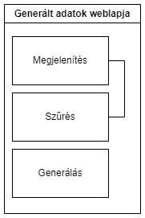
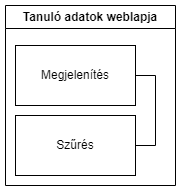
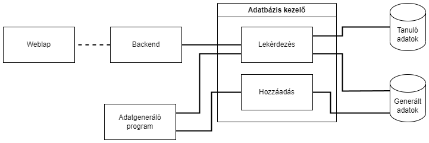
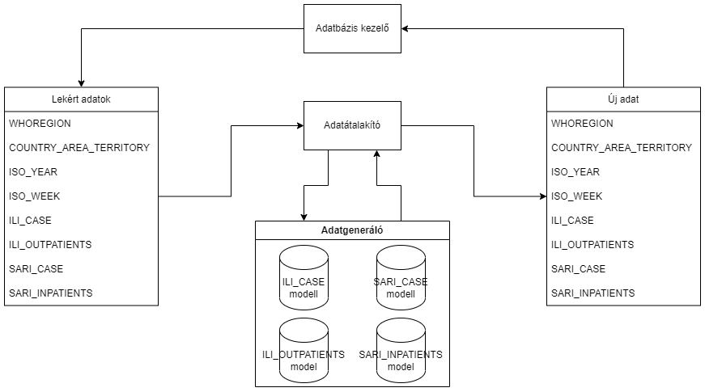

# Rendszerterv

## A rendszer célja

A rendszer célja, hogy  az emberek könnyebben tudjanak informálódni a covid és influenzás betegek számáról. A könnyen kezelhető webes alkalmazáson információ jellegű adatok találhatóak. Az adatokat lehet szűri országokra és régiókra. 

Mivel az alkalmazást csak Webes felületen szeretnénk elérhetővé tenni, nem célunk hogy más ,például IOS vagy android operációs rendszerrel rendelkező eszközön fusson.

A rendszer az adatokat a projecten belül saját adatbázisban tárolja aminek az adatai a WHO nyílt adatait tartalmazza(https://www.who.int/teams/global-influenza-programme/surveillance-and-monitoring/influenza-surveillance-outputs FluID dataset: A FluID egy globális platform az adatmegosztásra, amely összekapcsolja a regionális influenzajárványokról szóló adatokat egyetlen globális adatbázissá.).

## Projektterv

A projekt egy webes frontend, ami kommunikál egy adatbázissal és egy betanított modellel, ami múltbéli influenza adatok alapján generál új adatokat.

### Elvégzendő feladatok

Az elvégzendő feladatok közé tartozik a rendszer létrehozása és a tesztek elvégzése.

A rendszer elkészítésének fontosabb lépései a:

- Reszponzív és felhasználóbarát webes felület elkészítése
- Adatbáziskezelő rendszer megvalósítása
- Tanuló és generált adatok adatbázisának létrehozása
- Gépi tanulásos algoritmus elkészítése és betanítása
- Betanított modell felhasználása új adatok generálására
- Frontend és backend kommunikáció megvalósítása
- Rendszermodulok különálló tesztelése
- Rendszermodulok közös működésének tesztelése

Fontos minden rendszerelemet külön és a többivel együttműködve is tesztelni.

Ezért a tesztelés több lépésben valósul meg:

- Részleges tesztelés
- Teljes tesztelés
- Közös tesztelés

A projekten dolgozók mindegyikének részt kell vennie a rendszer megvalósításában.

### Felelősségi körök

| Név | Felelősségi kör | Vállalt rész |
|-----|-----------------|--------------|
| Czinege Lajos | Programozó | Backend megírása |
| Jurás Dorka | Programozó | Adatbáziskezelő rendszer megvalósítása |
| Kovács Zsolt | Programozó | Gépi tanulásos modell elkészítése és adatok generálásának megvalósítása |
| Madar Boglárka | Programozó | Felhasználóbarát és reszponzív megjelenítés megvalósítása |

### Mérföldkövek

A projekt legfontosabb mérföldkövei:

- Modulok részleges elkészülése
- Demo bemutatása
- Modulok teljes elkészülése
- Modulok közös működésének megvalósítása
- Rendszer átadása

### Ütemterv

Az ütemterv két fontos rézben áll, a programozásos feladatok és a nem-programozásos feladatok.

#### Programozáshoz kötődő feladatok ütemterve

A programozásos feladatok tartalmazzák egyes rendszermodulok megvalósítását, valamint az egységtesztelhető modulok és funkciók egységtesztelését.

| Feladat | Határidő |
|---------|----------|
| Modulok részleges elkészítése | 2023. 11. 05. |
| Modulok részleges működésének tesztelése | 2023. 11. 05. |
| Demo bemutató | 2023. 11. 05. |
| Modulok teljes működésének megvalósítása | 2023. 11. 26. |
| Teljesen elkészült modulok tesztelése | 2023. 11. 26. |
| Modulok közös működésének megvalósítása | 2023. 11. 26. |
| Modulok közös működésének tesztelése | 2023. 11. 26. |
| Végleges rendszer átadása | 2023. 11. 26. |

### Programozáshoz nem kötődő feladatok ütemterve

A nem-programozásos feladatok tartalmazzák a nem-egységtesztelhető modulok és funkciók tesztelését valamint a testlogok kitöltését.

| Feladat | Határidő |
|---------|----------|
| Modulok részleges működésének tesztelése | 2023. 11. 05. |
| Részlegesen elkészült modulok tesztjeiről testlog kitöltése | 2023. 11. 05. |
| Teljesen elkészült modulok tesztelése | 2023. 11. 26. |
| Teljesen elkészült modulok tesztjeiről testlog kitöltése | 2023. 11. 26. |
| Modulok közös működésének tesztelése | 2023. 11. 26. |
| Modulok közös működésének tesztjeiről testlog kitöltése | 2023. 11. 26. |

## Üzleti folyamatok modellje

1.Üzleti Szereplők:

Felhasználók: Azok, akik használják a webes felületet, hogy hozzáférjenek COVID és influenza betegek adataihoz, és országok szerinti szűrési lehetőségekhez.
  
Adminisztrátor: Az adminisztrátoroknak az alábbi feladatokat szükséges elvégezniük:
  roblémák kezelése: Az adminisztrátorok foglalkozhatnak a problémákkal, panaszokkal vagy visszajelzésekkel.
  Rendszerkarbantartás: Az adminisztrátorok felelősek a rendszer karbantartásáért, például biztonsági mentések készítéséért és a rendszer teljesítményének optimalizálásáért.
  Adatbiztonság és adatvédelem: Az adminisztrátorok felelősek lehetnek az adatbiztonság és adatvédelem fenntartásáért.
  Kommunikáció: Gyakori kommunikálás a felhasználókkal, például: értesítés küldése, válasz a felhasználó kérdéseisre, kéréseire.
Az adminisztrátorok szerepe tehát az alkalmazás hatékony működésének és a felhasználók támogatásának biztosítása, valamint a biztonság és adatvédelem fenntartása.

2.Üzleti Folyamatok:

Adatok Böngészése és Szűrése:
  A felhasználók megtekinthetik a rendszerben található COVID és influenza betegek adatait.
      Lehetőség van az adatok országok szerinti szűrésére, hogy megnézzék egy adott országban regisztrált betegek adatait.
      
Adatok Megtekintése:
  A felhasználók megtekinthetik az egyes betegségek havi betegeinek számát.
      
Adatok Frissítése (Adminisztrátor szereplők számára):
  Az adminisztrátorok felelősek az adatok frissítéséért, például új betegek hozzáadásáért vagy meglévő betegek adatainak módosításáért.
      
Adatok Rendszeres Karbantartása (Adminisztrátor szereplők számára):
  Az adminisztrátorok biztosítják, hogy az adatok naprakészek és megbízhatóak legyenek.
  		
3.Üzleti Entitások:
	COVID és Influenza Betegek Adatbázisa: Az adatbázis tartalmazza a COVID és influenza betegek számát.

## Követelmények

Ez azoknak a követelményeknek a listája, amelyeket szeretnénk mindenképpen megvalósítani. Ezek a fejlesztés során még változhatnak.

### Funkcionális követelmények

> **Weboldal létrehozása**

**Röviden a követelménylistából**: Weblap létrehozása az adatok megtekintésére.

Mivel azt szeretnénk elérni ezzel a rendszerrel, hogy bármilyen személy által használható legyen, ezért a legegyszerűbb módon kell a felhasználók kezébe juttatni - ez a mai világban az internet segítségével történik.

Az adatok megjelenítésére egy weboldalt kell létrehoznunk, amely bármilyen gépi böngésző által megnyitható és könnyen kezelhető, értelmezhető.

> **Tanuló adatbázis adatainak lekérdezése**

**Röviden a követelménylistából**: A weblapon a felhasználónak képesnek kell lennie lekérdezni a tanuló adatbázis adatait.

A tanuló adatbázisunk a WHO által kiadott hivatalos adatoknak egy szűrt változata, amelyet arra használunk, hogy betanítsunk egy modellt majd új adatok generálására.

Azért fontos, hogy a felhasználó ehhez az adatbázishoz hozzájusson és le tudja kérdezni az adatait, mert ez az adatbázis tárolja az eddig feljegyzett összes influenzás és COVID beteg számát, így jelentős információt tartalmaz magában.

> **Tanuló adatbázis minden adatának lekérdezése**

**Röviden a követelménylistából**: A felhasználónak képesnek kell lennie a tanuló adatbázis összes adatának lekérdezésére.

Terveink szerint a weblap már betöltéskor meg fogja jeleníteni a tanuló adatbázist teljes egészében, de biztosítanunk kell arra is lehetőséget, hogy maga a felhasználó is lekérdezhesse az adatbázis összes adatát.

> **Tanuló adatbázis lekérdezése WHO régió szerint**

**Röviden a követelménylistából**: A felhasználónak képesnek kell lennie a tanuló adatbázis adatait WHO régió szerint lekérdezni.

A WHO 6 különböző részre osztotta a világot annak érdekében, hogy összeszedettebb adatokat tudjanak gyűjteni, azokat analizálni és megfigyelni.

Ez az egyik legszemléletesebb felosztás az adatbázisban, ezért is fontos, hogy a felhasználó külön szűrhessen erre a kategóriára.

> **Tanuló adatbázis lekérdezése országnév szerint**

**Röviden a követelménylistából**: A felhasználónak képesnek kell lennie a tanuló adatbázis adatait országnév szerint lekérdezni.

Mivel a világ minden országát leginkább a saját maga adatai érdekelnek, érthető módon, ezért fontos megadni a felhasználónak azt a lehetőséget, hogy országnév szerint szűrhessen az adatbázisban.

> **Tanuló adatbázis lekérdezése időszak szerint**

**Röviden a követelménylistából**: A felhasználónak képesnek kell lennie a tanuló adatbázis egy bizonyos időszakra eső adatainak lekérdezésére.

Ahogyan az az influenzára és járványokra jellemző, nem minden betegség van jelen az év minden időszakában, vagy egyáltalán nem is létezik még egyes időszakokban.

Ezért gondoljuk azt fontosnak, hogy a felhasználónak legyen lehetősége az adatokat lekérdezni csak a számára fontos időszakokban, amennyiben van adatunk az adott időszakról.

> **Tanuló adatbázis lekérdezése K4 vagy K5 és K6 szerint**

**Röviden a követelménylistából**: A felhasználónak képesnek kell lennie a tanuló adatbázis adatait WHO régió vagy országnév, és adott időszak szerint is lekérdezni.

Az előbbi három pont ötvözeteként, fontos úgy kialakítanunk a rendszert, hogy a felhasználó egyszerre szűrhessen ezekre a fontosabb adatokra, hogy annál pontosabb adatokhoz juthasson hozzá.

> **A tanuló adatok adatbázisban történő tárolása**

**Röviden a követelménylistából**: A tanuló adatokat egy SQL adatbázisban kell tárolni.

Annak érdekében, hogy a WHO által kiadott hivatalos adatok szűrt változatát tömören és egy, könnyen elérhető helyen tároljuk, ezért létre kell hoznunk egy adatbázist.

Az adatok így könnyebben elérhetőek és használhatóak, és kevesebb helyet foglalnak a rendszerre nézve, mint ha más tárolási módot keresnénk.

> **A predikált adatok adatbázisban történő tárolása**

**Röviden a követelménylistából**: A predikált adatokat egy SQL adatbázisban kell tárolni.

Az alkalmazásunk legegyedibb tulajdonsága az lesz, hogy betanított modell segítségével meg tudjuk jósolni az influenzás és COVID betegek számának változását a jövőre nézve.

A betanított modell által generált adatokat is szükséges tárolnunk valahol, így a tanító adatbázis példájára ezeket az új adatokat is egy adatbázisban fogjuk tárolni.

> **Predikált adatok generálása**

**Röviden a követelménylistából**: A predikált adatokat egy python program készíti gépi tanulással.

Ahogy azt ez előbbi pontban írtuk, további megbetegedések adatainak jóslása az egyik legfontosabb része szoftverünknek.

A modell terveink szerint mi általunk lesz megépítve és betanítva a tanuló adatbázis adatai szerint, így szeretnénk olyan adatokat generálni, amelyek a legközelebb álhatnak a jövő tényleges megbetegedésinek adataihoz.

> **ILI gyanús esetek prediktálása**

**Röviden a követelménylistából**: A programnak prediktálnia kell az ILI gyanús megbetegedések számát.

A tanuló adatbázis egyik adatoszlopa az ILI gyanús (influenzagyanús) megbetegedések számát tárolja, ezért a betanított modellünknek sikeresen meg kell tudni jósolnia ezen adatok lehetséges jövőbeli fejlődését.

> **ILI járóbetegek prediktálása**

**Röviden a követelménylistából**: A programnak prediktálnia kell az ILI járóbetegek számát.

A tanuló adatbázis egyik adatoszlopa az ILI (influenzás) járóbetegek számát tárolja, ezért a betanított modellünknek sikeresen meg kell tudni jósolnia ezen adatok lehetséges jövőbeli fejlődését.

> **SARI gyanús esetek prediktálása**

**Röviden a követelménylistából**: A programnak prediktálnia kell a SARI gyanús megbetegedések számát.

A tanuló adatbázis egyik adatoszlopa a SARI gyanús (súlyos léguti megbetegedésgyanús) megbetegedések számát tárolja, ezért a betanított modellünknek sikeresen meg kell tudni jósolnia ezen adatok lehetséges jövőbeli fejlődését.

> **SARI fekvőbetegek prediktálása**

**Röviden a követelménylistából**: A programnak prediktálnia kell a SARI fekvőbetegek számát.

A tanuló adatbázis egyik adatoszlopa a SARI (súlyos léguti megbetegedés) fekvőbetegek számát tárolja, ezért a betanított modellünknek sikeresen meg kell tudni jósolnia ezen adatok lehetséges jövőbeli fejlődését.

### Nem-funkcionális követelmények

> **A tanuló adatbázis tartalma**

**Röviden a követelménylistából**: A tanuló adatbázis csakis a WHO hivatalos adatait tartalmazza.

Ez a követelmény több okból is fontos: először is, hogy a felhasználó csak olyan adatokhoz jusson hozzá, amelyek hitelesek. Számukra ugyanis a weboldal csak a tájékozódás helye, ezért biztosítanunk kell, hogy hiteles adatokat adunk át nekik.

Továbbá a WHO hivatalos adatai azért is fontosak, mert nekünk ezek az adatok adnak alapot a modellünk betanítására. Ha nem hivatalos, hiteles adatokkal dolgoznánk, akkor semmi értelme nem lenne a betanításnak, és magának a programunknak sem.

> **A tanuló adatbázis ne tartalmazzon felesleges oszlopokat**

**Röviden a követelménylistából**: A tanuló adatbázis a WHO hivatalos adatainak egy szűrt változatát tartalmazza a predikcióhoz szükségtelen adatoszlopokat elhagyva.

A WHO által kiadott hivatalos adatok között több olyan adatoszlop is található, amelyek nem sokat mondanak olyan személyeknek, akik nem foglalkoznak egyes tárgyakkal, mint a földrajz, biológia vagy informatika.

Ezért, és hogy a betanított modellünknek ne kelljen extra munkát végeznie, úgy döntöttünk, hogy az eredeti adatokat leszűrjük egy olyan mennyiségre, amelyek könnyen értelmezhetőek bármilyen felhasználó által.

> **A tanuló adatbázis csakis egész népességre vonatkozó adatokat tartalmazzon**

**Röviden a követelménylistából**: A tanuló adatbázis a WHO hivatalos adatainak egy szűrt változatát tartalmazza a korosztályokra lebontott adatsorok elhagyásával.

A WHO által kiadott hivatalos adatok több korosztályra vannak bontva, amely csak nehezíti az adatok értelmezését és emellett több helyet foglal el az eszközön.

Úgy döntöttünk, hogy az összes korosztály meghagyása helyett csak az '*All*' korosztályú adatsorokat hagyjuk meg, amellyel végső soron adatvesztés nem keletkezik, mert így is az összes feljegyzett hiteles adat megmaradt.

> **A tanuló adatbázis adatai**

**Röviden a követelménylistából**: A tanuló adatbázis adatoszlopai a következők legyenek: WHO régió, országnév, dátum, ILI gyanús esetek, ILI járóbetegek, SARI gyanús esetek, SARI fekvőbetegek.

Az előző három pontot összegezve úgy döntöttünk, hogy ezek az adatoszlopok tartalmazzák azokat az adatokat, amelyekre az általános felhasználók leginkább kíváncsiak.

Ahogy azt már a fentebb leírt Funkcionális követelmények részben írtuk, az első három adatoszlopból lehet majd a felhasználónak lekérdezni, míg az utolsó négy oszlop tartalmazza az influenzás és COVID betegek számát.

> **A predikció történjen gépi tanulással**

**Röviden a követelménylistából**: A predikcióért felelős program használjon gépi tanulást az új adatok előállítására.

Annak érdekében, hogy a felhasználónak legyen egy elképzelése arról, hogyan fognak alakulni a tanuló adatbázisban található adatok, szeretnénk ha az általunk fejlesztett program meg tudná ezeket az adatokat jósolni.

Ezt úgy tudjuk a legegyszerűbben elérni, hogy a modellünk gépi tanulást használ.

> **A predikált adatok elkészítése**

**Röviden a követelménylistából**: A predikált adatokat egy előre betanított modell alapján lekérésre generálja a rendszer.

Míg a tanuló adatbázis már a weboldal betöltésével együtt létezik a felületen, addig a modell által generált adatok csak akkor fognak ténylegesen létezni, amint a felhasználó lekérdezte őket.

Ez azért is jelentős, mert ahogyan az idő múlik, annál frissebb adatok lesznek a tanuló adatbázisban, és úgy fog fejlődni a betanított modell is, ezért nem elégedhetünk meg azzal, hogy mi egyszer legeneráljuk a predikált adatokat, és azzal térünk vissza a felhasználónak.

A modell nem fog miden egyes lekérdezéssel újra betanítódni, viszont az adatok mindig változnak - ezért fontos így elkészítenünk az adatokat.

> **Figyelmeztetni a felhasználót a predikált adatok pontatlanságára**

**Röviden a követelménylistából**: Figyelmeztetni kell a felhasználót, hogy a generált adatok gépi tanulás útján lettek generálva.

Akármennyire sokáig tanítunk be egy modellt, az semmiképpen sem fogja tudni pontosan megjósolni a jövőt, mivel mi emberek se tudjuk azt megtenni.

Éppen ezért szükséges tájékoztatnunk a felhasználót arról, hogy ha a predikált adatokkal foglalkozik, számítson arra, hogy az adatok nagy valószínűséggel pontatlanok, és ez ellen mi magunk sem tudunk semmit sem tenni.

> **Figyelmeztetés kevés adat esetén**

**Röviden a követelménylistából**: Országoknál vagy régióknál, ahol kevés a tanuló adat, ott figyelmeztessen a weboldal a növekedett hibavalószínűségre.

Erre a WHO hivatalos oldala is felhívja a figyelmet, mivel vannak egyes országok és régiók, ahol ők se tudtak elég, vagy elég hiteles adatot szerezni.

Mivel mi az ő általuk kiadott adatokat használjuk, mi nekünk is fontos figyelmeztetni a felhasználót ebben az esetben.

> **A weboldal felhasználóbarátsága**

**Röviden a követelménylistából**: A weboldalnak felhasználó barátnak kell lennie.

Szeretnénk, ha programunkat nem csak olyan felhasználók tudnák használni és megérteni, akik jártasak az informatika vagy biológia egyes területeiben, hanem bárki, akit érdekelnek ezek at adatok.

Ezért szükséges egy olyan weboldalt kialakítanunk, amelyet könnyű használni bármilyen felhasználó által, függetlenül koruktól, hozzáértésüktől.

> **A weboldal reszponzivitása**

**Röviden a követelménylistából**: A weboldalnak reszponzívnak kell lennie, hogy bármilyen képernyőn felhasználóbarát módon jelenjen meg.

Mivel a világon nem minden személy egy fajta eszközt használ, ezért fontos arra is gondolnunk, hogy minden gépi eszközön sikeresen meg tudjuk jeleníteni oldalunkat.

Bár a programot nem fejlesztjük mobil eszközökre, reméljük, hogy bármilyen más gépi eszköz képernyőjén meg tudjon jelenni az oldal úgy, hogy tartsa formáját és használhatóságát.

### Törvényi előírások, szabványok

Programunknak szükséges megfelelnie az Európai Unió Általános adatvédelmi rendeletének (GDPR).

Ezen kívül szükséges betartanunk a WHO adatszabályzatát is, amely megtalálható a következő linken: [WHO Data Policy](https://www.who.int/about/policies/publishing/data-policy).

## Funkcionális terv

### Felhasználói felület

A felhasználói felület egy weblap, amin a felhasználó megtekintheti és szűrheti a tanuló adatbázis és a generált adatbázisok tartalmát, valamint új adatokat generáltathat.

Két lapot tartalmaz a weboldal, egyet a generált adatoknak és egyet a tanuló adatoknak.

A weblapok között egy navigációs menü segítségével válthatunk.

#### Generált adatok lapja

Funkciók:

- Generált adatok megjelenítése
- Generált adatok szűrése
- Új adatok generáltatása

A megjelenített adatok dinamukisak, mindig az adatbázis jelenlegi állapotát tükrözik.

Ezen a lapon megtekinthetők a korábban generált adatok.

Új adatok generáltatása esetén az adatok bekerülnek a generált adatok adatbázisába, majd megjelenítésre kerülnek.

#### Tanuló adatok lapja

Funkciók:

- Tanuló adatok megjelenítése
- Tanuló adatok szűrése

A megjelenített adatok dinamikusan, mindig az adatbázis jelenlegi állapotát tükrözik.

A tanuló adatbázis csakis a WHO hivatalos adatait tartalmazza.

### Adatbázis kezelő

Az adatbázis kezelő felelős az adatbázissal való közvetlen kommunikációért.

Elvégzi a lekérést, majd továbbitja az adatokat.

Mindkét adatbázis az adatbázis kezelőn keresztül érhető el.

#### Adatbázis kezelő funkciói

Az adatbázis kezelő lekérdezést mindkét adatbázishoz biztosít.

Az adatbázis kezelő a hozzáadás lehetőségét csakis a generált adatok adatbázisához biztosít.

### Adatgeneráló

Az adatgeneráló program egy betanított gépi tanulásos modelleket használó program.

#### Modellek

Az adatgeneráló program négy modellt használ.

- ILI gyanús esetek számának generáltatására
- ILI járóbetegek számának generáltatására
- SARI gyanús esetek számának generáltatására
- SARI fekvőbetegek számának generáltatására

#### Működés

A modellek csakis számadattal dolgoznak, ezért a kapott adatokat át kell alakítani, ezért egy adatátalakító felelős.

Az átalakított adatokat megkapja az adatgeneráló program, ami mind a négy modellel új adatokat generál.

A generált adatokat visszaadja az adatátalakítónak, majd az átalakító továbbítja az adatbázis kezelőnek.

### Adatátalakító

Az adatátalakító a kapott adatbázis adatok szöveges oszlopaihoz számokat rendel, majd így továbbítja az adatgenerálónak.

A megjelenő WHO régiók kódjait és országok neveit a abc sorrendben sorszámozzuk, majd ezzel helyettesítve továbbítjuk az adatgenerálónak.

### Backend

A backend feladata összekötni a weblapot, az adatbázis kezelőt és az adatgenerálót.

A backend a felhasználói felületen beállítottak szerint jelzi az adatbázis kezelőnek milyen adatokra van szükség, majd a kapott adatokat megjeleníti a weblapon.

Új adat generálása szerint a backend jelzi az adatgenerálónak, hogy milyen adatokat kell generálni, majd a generáló lefutása után jelzi az adatbázis kezelőnek milyen adatokra van szükség, majd megjeleníti a weblapon.

## Fizikai környezet

A fizikai környezet részei a webes front-end, ami megjeleníti az adatokat, a python backed, ami biztosítja az adatbázis és az ML algoritmus elérését, az sql adatbázisok, amik az adatok tárolásáért és lekéréséért felelősek és a python ML algoritmus, ami új adatok generálására szolgál.

### Webes felület

A webes felület felelős az adatok megjelenítéséért a felhasználó számára, ezért fontos, hogy könnyen átlátható, könnyen kezelhető és bármilyen eszközről megjeleníthető legyen.

#### Felépítés

A webes felület felépítéséhez hagyományos módon HTML5-öt és CSS3-at használunk.

#### Reszponzivitás

A reszponzivitás megvalósításához bootstrap-et használunk, mivel a bootstrap egy elterjedt és jól bevált technológia.

### Backend-program

Összeköti a komponenseket.
A weboldal backendjét Python nyelven írjuk, elsősorban az ML algoritmussal való egyszerű integrálhatóság kedvéért.

### Adatbázis

SQL adatbázisok felelősek az adatok tárolásáért.
Minden tárolt adat lekérdezhető, generált adatok adatbázisához hozzá lehet adni, valamint el lehet belőle távolítani, a tanuló adatok adatbázisát nem lehet módosítani.

#### Adatbázis-kezelő

Egy Python program, ami felelős a lekérdezések elvégzéséért, valamint a generált adatok hozzáadásáért.

Azért választottuk a Python nyelvet, hogy a többi komponenssel egyszerűen integrálható legyen.

### ML Program

Felelős múltbéli adatok alapján jövőbeli adatok generálásáért.

Python nyelvben fog íródni, mivel a Python egy széleskörben használt és jól bevált eszköz hasonló feladatok megvalósításához.

#### Felhasználandó programcsomagok

- Tensorflow - Gépi tanulás
- Keras - Gépi tanulás
- Numpy - Szükséges adatszerekezetek
- Pandas - Szükséges adatszerkezetek

##### Tensorflow és Keras

A tensorflow és keras gépi tanulásos problémák megoldásakor együttesen kerülnek felhasználásra.
Szükségesek neurális hálók kiépítéséhez és a predikció elvégzéséhez.

##### Numpy

A numpy egy nagyon hasznos eszköz, ami megfelelő adatszerkezetet biztosít a gépi tanulás be- és kimenetének.
Tartalmaz továbbá különböző hasznos matematikai függvényeket, amik segítik a hatékony modell elkészítését.

##### Pandas

A pandas egy tudományos eszköz, ami nagy mennyiségű adat egyszerű kezelését teszi lehetővé a dataframe adatszerkezetével,
valamint adat analitikai eszközöket biztosít a tanuló adatok elemzéséhez és szűréséhez a megfelelő modell létrehozása érdekében.

### A megvalósítandó alkalmazás

A megvalósítandó alkalmazás egy webalkalmazás.
Vagyis bármilyen webböngészővel rendelkező eszközről elérhető és használható.
A reszponzivitás megvalósításával eszközmérettől függően változik a megjelenítés így tovább növelve az elérhetőségét.

## Absztrakt domain modell

### Domain specifikáció, fogalmak

#### Fogalmak:

* **Webes alkalmazás (WebApp):** Az alkalmazás, amely lehetővé teszi a felhasználók számára, hogy böngésszenek és lekérdezzék az influenzás és COVID-19 megbetegedések adatait, valamint predikciós információkat nyújt.

* **Tanuló adatbázis:** Az adatbázis, amely tartalmazza az influenzás és COVID-19 megbetegedések előzményeit és a modell betanításához szükséges adatokat.

* **Prediktált adatbázis:** Az adatbázis, amely tartalmazza a jövőbeli influenzás és COVID-19 megbetegedések előrejelzett számait a betanított modell segítségével.

* **Betanított modell:** A gépi tanulási modell, amely a tanuló adatok alapján generálja a prediktált adatokat.

* **Felhasználói felület:** Az alkalmazás grafikus része, amely lehetővé teszi a felhasználók számára az adatok lekérdezését és megjelenítését.

### Absztrakt komponensek, ezek kapcsolatai

#### Absztrakt komponensek:

* **Webes alkalmazás (WebApp):** A fő alkalmazás, amely lehetővé teszi a felhasználók számára a tanuló és prediktált adatok böngészését és lekérdezését.

* **Tanuló adatbázis:** Az adatbázis, amely tartalmazza a történelmi influenzás és COVID-19 megbetegedések adatait.

* **Prediktált adatbázis:** Az adatbázis, amelyben a gépi tanulási modell generálja a jövőbeli influenzás és COVID-19 megbetegedések becsléseit.

* **Gépi tanulási modell:** A modell, amely tanul a tanuló adatbázis adataiból, majd predikciókat hoz létre a prediktált adatbázis számára.

* **Felhasználói felület:** Az alkalmazás része, ahol a felhasználók találkoznak és interakcióba lépnek az alkalmazással.

#### Kapcsolatok:

A Webes alkalmazás kommunikál mindkét adatbázissal, az Gépi tanulási modell a Tanuló adatbázis adatait felhasználva a predikciókhoz.

A Gépi tanulási modell rendszeresen frissíti a Prediktált adatbázist az új adatokkal és predikciókkal.

A Felhasználói felület lehetővé teszi a felhasználók számára a Tanuló adatbázis és a Prediktált adatbázis lekérdezését, valamint a gépi tanulási modellek által generált adatok megjelenítését.

A Felhasználói felület információkat jelenít meg a felhasználóknak az adatok eredetéről és a gépi tanulási modellek használatáról.

A Webes alkalmazás figyelmezteti a felhasználókat, ha az adatok pontatlansága vagy kevés tanuló adat esetén a predikciók megbízhatatlanná válhatnak.

## Architekturális terv

### Egy architekturális tervezési minta 

Az alkalmazás architekturális tervezési mintája segít az alkalmazás szervezésében és az egyes komponensek közötti kapcsolatok meghatározásában. Egy jól megválasztott minta növelheti az alkalmazás skálázhatóságát, karbantarthatóságát és kiterjeszthetőségét.

### Az alkalmazás rétegei, fő komponensei, ezek kapcsolatai

#### Alkalmazás rétegei:

* Felhasználói felület réteg:
   * **Felhasználói interfész (UI):** A webes alkalmazás ezen rétege felelős az alkalmazás felhasználói felületének megjelenítéséért. 
   A felhasználók itt kezdeményezik a különböző lekérdezéseket, megadhatják a kívánt szűrőket (országok, régiók) és megjelenítik az eredményeket.

* Üzleti logika réteg:
   * **Lekérdezés-szolgáltatás:** Ebben a rétegben található a logika a felhasználói kérések feldolgozásához és az adatbázisokhoz való kapcsolódáshoz. 
   A szolgáltatás lehetővé teszi a felhasználók számára, hogy lekérdezzék a tanuló adatbázis adatait és generálják az új adatokat a betanított modell segítségével.

* Adatbázis réteg:
   * **Tanuló adatbázis:** Ez a komponens tartalmazza a tanuló adatbázist, amely az influenzás és COVID megbetegedések előző évek adatait tartalmazza. 
   Az adatbázisban szerepelnek az országok és régiók adatai, valamint az influenzás és COVID megbetegedések számok éves és heti bontásban.
   * **Prediktált adatok adatbázis:** Ez a komponens tartalmazza azokat az adatokat, amelyeket a gépi tanulással generáltak a jövőbeli megbetegedések becsléséhez.
   A prediktált adatokat itt tárolják az alkalmazás naprakészen tartásához.

* Gépi tanuló program réteg:
   * **Betanított modell:** Ez a komponens tartalmazza a gépi tanulással betanított modellt, amely az előző évek adatokon alapuló becsléseket generál a jövőbeli megbetegedések számára.

* Hálózati réteg:
   * **Adatbeszerzési szolgáltatások:** Ennek a rétegnek a feladata a tanuló adatbázisból és más forrásokból származó adatok beszerzése, valamint a gépi tanuló programnak az új adatok feltöltése.

#### Rétegek és komponensek közötti kapcsolat:

A felhasználói felület (UI) réteg a felhasználókat összekapcsolja az API szerverrel, hogy lekérdezéseket végezzen a tanuló adatbázison és prediktált adatokon keresztül.

Az API szerver közvetíti a kéréseket és kapcsolódik az üzleti logika és adatkezelés réteghez. Ez az összeköttetés lehetővé teszi az adatok lekérdezését az adatbázisból és a prediktált adatok elérést a prediktáló programhoz.

Az üzleti logika és adatkezelés réteg felelős az adatbázis működtetéséért, a tanuló adatok és prediktált adatok betöltéséért, valamint a prediktáló programhoz való kapcsolódásért. Az adatbázis tartalmazza a tanuló és prediktált adatokat, amelyek a gépi tanulás alapján generálódnak.

A gépi tanuló program réteg tartalmazza a tanuló modellt, amely a tanuló adatok alapján generálja a prediktált adatokat. Az új adatokat visszatölti az adatbázisba.

A kapcsolat az adatbázisok és a prediktáló program között a tanuló adatok betöltését és a prediktált adatok frissítését szolgálja. Az adatok a prediktáló program által generálódnak, majd tárolódnak az adatbázisban.

Az üzleti logika és adatkezelés réteg közvetít az API szerver és a gépi tanuló program között. Az API szerver lekéri az adatokat a tanuló adatbázisból, majd elküldi azokat a prediktáló programnak a generáláshoz. Az új adatok frissítése a prediktált adatbázisban is ezen a rétegen keresztül történik.

### Változások kezelése

A változások kezelése kiemelkedően fontos az olyan webes alkalmazások esetében, amelyek epidemiológiai becsléseket készítenek, mint például a COVID és influenza becslő alkalmazás.

Az alábbi szempontok fontosak a változások hatékony kezeléséhez:

* Adatfrissítések kezelése:  
   * Az alkalmazásnak rendszeresen frissítenie kell az adatokat megbízható forrásokból, jelenesetben a WHO adatait, hogy mindig naprakészek legyenek.

* Automatikus frissítések:  
   * Érdemes automatikus frissítési mechanizmusokat bevezetni, amelyek rendszeresen ellenőrzik az adatforrásokat, és frissítik az alkalmazás adatbázisát vagy adatokat.

* Felhasználói visszajelzés:  
   * A weboldalnak lehetőséget kell biztosítania a felhasználóknak a visszajelzés küldésére, például: ha úgy érzik, hogy az adatok vagy becslések pontatlanok. 
   Ez segíthet az alkalmazás fejlesztésében és javításában is.

* Hibajavítás:  
   * Reagállni kell a hibajelentésekre, és problémákra, különösen akkor, amikor fontos változások történnek a járványügyi helyzetben.

* Jogszabályi változások:  
   * Ha jogszabályi változások történnek, például az adatvédelem vagy az egészségügyi előírások terén, az oldalnak alkalmazkodnia kell ezekhez a változásokhoz.

* Tesztelés és visszajelzés: 
   * Az új funkciókat, változásokat alaposan tesztelni kell, mielőtt élő rendszerbe kerülnének.	

### Rendszer bővíthetősége

A rendszer bővíthetősége kulcsfontosságú a hosszú távú sikerhez, mivel lehetővé teszi az alkalmazás funkcióinak és képességeinek kibővítését az új igények és technológiai fejlesztések alapján.

Folyamatos fejlesztések és frissítések szükségesek ahhoz, hogy az új funkciók és fejlesztések az aktuális igényekhez igazodjanak.

### Biztonsági funkciók

Az alkalmazásnak szigorú adatvédelmi politikával kell rendelkeznie, és megfelelő intézkedéseket kell tenni az érzékeny felhasználói adatok védelme érdekében.

## Adatbázis terv

**Megjegyzés - Ez még nem a végleges tervünk az adattárolásra. Terveink az alkalmazás fejelsztése alatt változhatnak, és ezt ezen pont frissítésével jelezni fogjuk.**

Terveink szerint az alkalmazásunk egy adatbázist fog alkalmazni ahhoz, hogy megfelelően működjön minden. Ehhez két külön táblára lesz szükségünk:

- Tanuló adatok
- Generált adatok

Az adattárolás és adatbázisok összehangolása, karbantartása, a szerver futtatása mind a Django keretrendszer segítségével fog megvalósulni terveink szerint.

### A Tanuló adatok adatbázis felépítése

Ez a tábla tartalmazza azokat az adatokat, amelyek a WHO hivatalos adatainak egy szűrt része (amelyek fontosak a mi általunk készített alkalmazás működéséhez). Ezen adatok a következők:

- **ID** (int) - Az adatok azonosítója. Elsődleges kulcs, amely egyedi minden egyes adatsorhoz. Ezt az adatbázis generálja.
- **WHOREGION** (varchar(10)) - A WHO régió neve. Nem lehet NULL érték.
- **COUNTRY_AREA_TERRITORY** (varchar(200)) - Az adott ország neve. Nem lehet NULL érték.
- **ISO_YEAR** (int) - Az év, amikor a mérés készült. Nem lehet NULL érték.
- **ISO_WEEK** (int) - A hét, amikor a mérés készült. Nem lehet NULL érték.
- **ILI_CASE** (int) - Az influenzagyanús betegek száma.
- **ILI_OUTPATIENTS** (int) - Az influenzás járóbetegek száma.
- **SARI_CASE** (int) - A súlyos léguti megbetegedésgyanús betegek száma.
- **SARI_INPATIENTS** (int) - A súlyos léguti mebgetegedéses fekvőbetegek száma.

### A Generált adatok adatbázis felépítése

Ez a tábla tartalmazza azokat az adatokat, amelyeket az általunk betanított modell fog generálni. Az adattábla éppen ezért eleinte nem tartalmaz semmilyen adatot, csak akkor fog frissülni adatokkal, amint a felhasználó valamilyen lekérdezést hajtott végre.

Az adattábla felépítése ugyanaz, mint a Tanuló adatok táblának, viszont csak olyan adatok és adatoszlopok fognak megjelenni az alkalmazói oldalon, amit a felhasználó lekérdezett. Addig amíg ez nem történik meg, a tábla üres, de oszlopai a következők:

- **ID** (int) - Az újonnan generált adatok azonosítója. Elsődleges kulcs, amely egyedi minden egyes adatsorhoz. Az adatbázis generálja minden egyes lekérdezés után.
- **WHOREGION** (varchar(10)) - A WHO régió neve. Nem lehet NULL érték.
- **COUNTRY_AREA_TERRITORY** (varchar(200)) - Az adott ország neve. Nem lehet NULL érték.
- **ISO_YEAR** (int) - Az év, amikor a mérés készült. Nem lehet NULL érték.
- **ISO_WEEK** (int) - A hét, amikor a mérés készült. Nem lehet NULL érték.
- **ILI_CASE** (int) - A betanított modell által generált inluenzagyanús betegek száma.
- **ILI_OUTPATIENTS** (int) - A betanított modell által generált influenzás járóbetegek száma.
- **SARI_CASE** (int) - A betanított modell által generált súlyos léguti megbetegedésgyanús betegek száma.
- **SARI_INPATIENTS** (int) - A betanított modell által generált súlyos léguti megbetegedéses fekvőbetegek száma.

## Tesztterv

A tesztelések célja a rendszer és komponensei funkcionalitásának teljes vizsgálata, ellenőrzése, a rendszer által megvalósított üzleti szolgáltatások verifikálása.

Ide tartoznak:

- **Felhasználó felület tesztelése**
  - A szoftvernek bármilyen operációs rendszeren és böngészőben meg kell tudnia jelenni.
  - A felhasználónak képesnek kell lennie az adatokat megtekinteni, szűrnie.
  - A felhasználónak képesnek kell lennie könnyen navigálnia a weboldal lapjai között.
  - A felületen megfelelően működjön a navigálás.

- **Adatbázis és adatbázis kezelő tesztelése**
  - Legyen meg az adatbázisok és az adatbázis kezelő között a kapcsolat.
  - Az adatbázis kezelő legyen képes elvégezni a lekéréseket.
  - Az adatbázis kezelő legyen képes továbbítani a lekért adatokat a weboldal felé.
  - Az adatbázis kezelő biztosítson lekérdezési engedélyt mindkét adatbázisnak.
  - Az adatbázis kezelő csak a generált adatbázisnak adjon hozzáadási engedélyt.

- **Adatgeneráló tesztelése**
  - Az adatgeneráló legyen képes új adatokat generálni az adatátalakítótól kapott adatokból.

- **Adatátalakító tesztelése**
  - Az adatátalakító az adatbázisból kapott szöveges adatokat legyen képes átalakítani számadattá.

- **Backend tesztelése**
  - A backend megfelelő összeköttetést biztosítson a weblap, az adatbázis kezelő és az adatgeneráló között.

## Telepítési terv
### Előfeltételek

#### Pycharm community edition

[Telepítsük a pycharmot](https://www.jetbrains.com/pycharm/download/?section=windows)

#### Python 3.9 telepítése

[Telepítsük a python 3.9-et innen](https://www.python.org/downloads/release/python-390/), utána indítsuk újra a Pycharmot.

#### Virtuális környezet létrehozása

Nyissuk meg a projektet a pycharmmal githubról, a projekt mappáját nevezzük "koffein-flu-prediction"-nek, utána végezzük el az alábbi lépéseket.

Settings > Project:[projektnév] > Python Interpreter > Add interpreter > Add local interpreter

Válasszuk a virtual environmentet, fenti rádiógombok közül válasszuk a new-t, a base interpreter legyen python 3.9

#### Csomagok telepítése

Nyissuk meg a pycharm terminált (Alt+F12), majd adjuk ki az alábbi parancsot, a figyelmeztetéseket hagyjuk figyelmen kívül:

pip install django

### Django oldal futtatása

Nyissuk meg a Pycharm terminált (Alt+F12), ezután lépjünk be a projekt koffein_flu_prediction almappájába a terminálból.

cd .\koffein_flu_prediction\

Majd futtassuk a django oldalt az alábbi paranccsal:

python manage.py runserver 

A terminálban látható "Starting development server at..." kezdetű sorban található címen érhetjük el az oldalt.

Leállítani a terminálban CTRL+C billentyűparancs kiadásával tudjuk.
