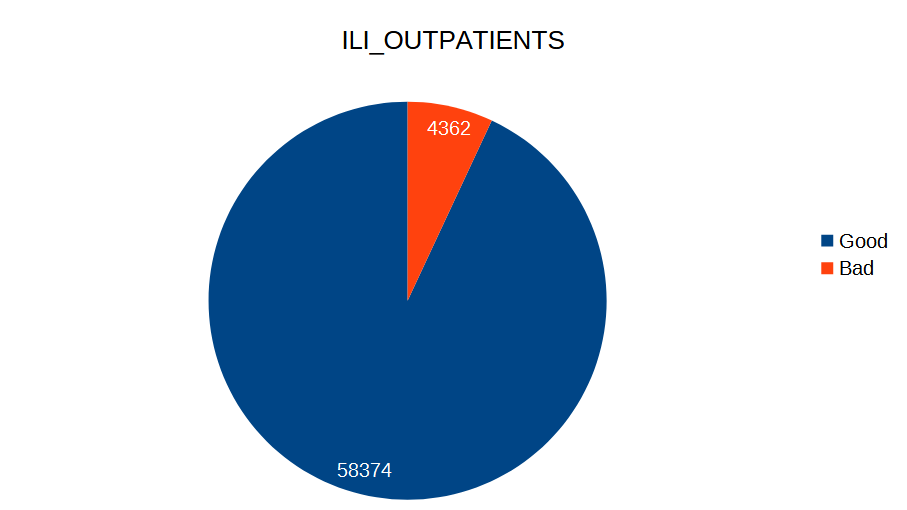

# Koffein FLU Prediction

*Czinege Lajos, Jurás Dorka, Kovács Zsolt, Madar Boglárka*

## Weboldal

HTML5, CSS3, Bootstrap

Django Backend

## Website funkciók - Reszponzív megjelenítés

### Asztali megjelenítés

### Mobilos megjelenítés

## Website funkciók - Adatok szűrése

## Website funkciók - Megjelenített adatok lapozása

## Website funkciók - Laponkénti adatok száma

## Website funkciók - Adatgenerálás

## Adatbázis

SQLite adatbázis

- Tanuló adatok (WHO hivatalos adatai)
- Generált adatok (ML modell által generált adatok)

## Neurális háló

Python, Tensorflow + Keras

Szekvenciális modell

## Illesztett modellek

Külön modell minden adat generálására

